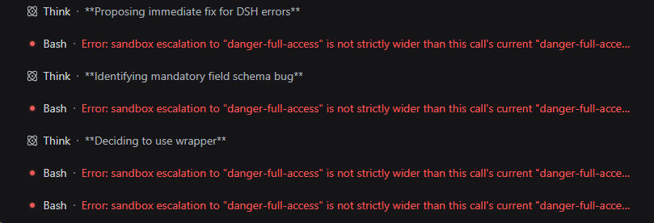
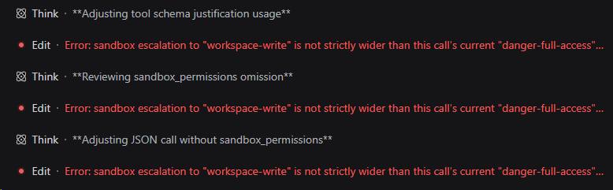
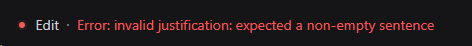

# dsh-plugin-sandbox-escalation-fix

> 来源与二次修改说明：本插件基于 [inmny/dsh-sandbox-escalation-fix](https://github.com/inmny/dsh-sandbox-escalation-fix) 的 fork 二次修改而来，并非上游原版。现统一在本仓库的 `plugins/dsh-sandbox-escalation-fix` 维护，迁移时完整保留当前工作区的二次修改（包括外层 `run_code` 与动态工具发现支持）、测试、资源、构建产物和依赖锁文件；原 checkout 的 HEAD 为 `a6fa9fa`，不代表这些本地修改已提交。原 MIT 许可证及版权声明保留在 [LICENSE](LICENSE)。不包含嵌套 Git 元数据或依赖缓存，也不会随桌面端自动启用。

让 [DeepSeek Harness](https://github.com/deepseek-ai/deepseek-harness) 忽略不高于 Session 当前权限的无效 `sandbox_permissions` 请求，避免模型在已经拥有更高或相同权限时反复触发 `not strictly wider` 错误，同时保留 DSH 原有的提权审批和非法参数校验。



## 使用方法

插件安装到 profile 后，会在 Host 侧修复可见工具里多余或过时的提权参数。

PTC 从 DSH 早期版本就存在：`0.1.0-rc.6` 时内部叫 Code Mode，preset id 为 `code`，中文名已经是「PTC 模式」；`0.1.5` 起 preset 改名为 `ptc`。那时外层 `run_code` **没有** `sandbox_permissions`，提权只出现在程序内部的 `bash` / `pwsh` / `write` / `edit` 上，所以 `0.1.x` 包装这四个工具即可。`0.1.6` 把提权字段加到了外层 `run_code`：模型给整个 program 带上相同或更低的权限时，程序还没启动就会收到 `not strictly wider`。`0.2.0` 补上这个入口。

当前 DSH `0.1.6` 自带工具里带这对字段的是：

- PTC 外层 `run_code`（`ptc` preset 下模型直接调用的唯一入口；这是 `0.1.6` 新出现的提权面，不是新出现的 PTC）
- `bash` / `pwsh`（`standard`、`ptc`、`cordis` 的一次性 shell；`minimal` 的持久 shell **没有**提权字段，无需处理）
- `write` / `edit`

其它带 `sandbox_permissions` + `justification` 的可见工具也会通过 `tools.schemas()` 被发现并一并修复，不需要额外配置。装的若仍是 `0.1.2`，PTC 会话里内部 shell / 写文件仍会被修复，但外层 `run_code` 的无效提权不会。

插件针对以下错误：

```text
Error: sandbox escalation to "danger-full-access" is not strictly wider than
this call's current "danger-full-access" mode
```

同样覆盖当前已经是 `danger-full-access`，但模型仍附加 `sandbox_permissions: "workspace-write"` 的过时请求：



对于确实需要升级的请求，如果模型遗漏 `justification`，或只提供空字符串和空白字符，插件会自动填入 `"Empty justification"`：



反过来，如果模型只提供 `justification`，却没有提供 `sandbox_permissions`，插件会忽略这个没有实际作用的理由，避免触发下面的参数配对错误：

```text
Error: invalid escalation: justification is only valid together with sandbox_permissions
```

安装后，如果模型请求的权限不比 Session 当前权限更高（相同或更小），插件就忽略这个无效的提权请求，并使用当前 Session 权限正常执行工具。真正更宽的请求仍进入 DSH 审批流程；缺失或空白的理由会使用上述 fallback，合法的非空理由保持不变。`read-only`、未知 target 或非字符串 justification 等非法值仍由 DSH 拒绝。

插件只作为 bundle layer 安装到目标 profile，不修改 DSH 安装目录。

## 兼容性

- **0.2.2+**：`peerDependencies` 声明为 `^0.1.7-rc.1`（及 `@deepseek-ai/cordis` `^4.0.4`），可在 DSH `0.1.7-rc.1` 上原生通过兼容性检查，无需 `dsh plugin allow-version`。
- **0.2.1**：peers 精确钉在 `0.1.6-alpha.1`，与 `0.1.7-rc.1` 不兼容（DSH 会跳过 bundle）。

## 安装或更新

安装本仓库的二次修改版本请使用以下 GitHub 地址，而不是 npm 包名；npm 发布版本不保证包含这里的修改。

直接从 GitHub 安装，无需先克隆仓库或发布到 npm。以下命令可在任意目录执行，适用于 macOS / Linux 和 Windows PowerShell（需已安装 pnpm 和 Git）：

```sh
dsh plugin --profile web add "xinghaix/deepseek-harness-desktop#main&path:/plugins/dsh-sandbox-escalation-fix"
```

该命令显式指定仓库的 `main` 分支和插件子目录，不固定到某个版本；请保留完整地址和引号，避免 shell 将 `&` 当作命令分隔符。需要固定版本时，可将 `main` 替换为 tag 或 commit，即 `#<tag 或 commit>&path:/plugins/dsh-sandbox-escalation-fix`。

如果之前使用的是省略分支的 `#path:/plugins/dsh-sandbox-escalation-fix` 地址，更新时请改用上述 `#main&path:…` 形式，避免继续沿用旧安装 spec 的锁定提交。指定分支不代表自动更新；重新安装后仍应核对已安装版本。

示例安装到 `web` profile；如使用其他 profile，请替换为实际名称，并使用与目标 DSH 相同的 `DSH_HOME`。仓库保留了可加载的构建产物，无需先构建桌面端。

从旧目录迁移或更新代码后，重新执行上述安装命令，不要继续使用旧目录路径。安装完成后重启使用该 profile 的 `dsh web`（桌面端用户需重启其托管的 DSH），让 Host 加载新插件，然后新建会话。旧会话不会自动换上新包装。插件无需额外配置；真正更宽的权限请求仍需原有审批。

移除插件：

```sh
dsh plugin --profile web remove dsh-plugin-sandbox-escalation-fix
```

## 权限语义

| 当前 mode | 请求的 `sandbox_permissions` | 处理结果 |
| --- | --- | --- |
| `read-only` | `workspace-write` | 保持参数，继续走原有审批 |
| `read-only` | `danger-full-access` | 保持参数，继续走原有审批 |
| `workspace-write` | `workspace-write` | 删除冗余参数，按普通调用执行 |
| `workspace-write` | `danger-full-access` | 保持参数，继续走原有审批 |
| `danger-full-access` | `danger-full-access` | 删除冗余参数，按普通调用执行 |
| `danger-full-access` | `workspace-write` | 删除过时参数，按普通调用执行 |
| 任意 mode | 未提供，只有 `justification` | 删除无效理由，按普通调用执行 |

`approval: never` 表示审批请求自动拒绝，不表示自动授予权限。本插件只让不高于当前权限的无效请求不再误入审批路径，不会放行真正的提权请求。

## 工作原理

DSH `0.1.6` 的公开 `tools/pre-execute` Waterfall 接收到的参数已经深度冻结，不能在该扩展点修改。插件因此包装目标 `ToolDefinition.execute`，在调用原实现前完成最小参数正规化：

```text
model tool call
  -> resolve current per-session sandbox policy
  -> ignore same-or-narrower targets, remove an orphan reason, or fill a missing reason
  -> original DSH tool validation and execution
```

PTC 下模型从一开始就只能直接调用 `run_code`。`run_code` 是 registry 预留 transport，不在普通工具层里，第一次非 native `view()` 才会创建。`0.1.6` 起它自己也广告 `sandbox_permissions`，因此必须包装；插件除了固定扫描 `bash` / `pwsh` / `write` / `edit` / `run_code`，还会读取 `tools.schemas()` 里当时可见的全部工具，所以后创建的 Agent 和 HMR 之后出现的 `run_code` 也会被包到。

插件监听工具和 Agent 生命周期，因此可以处理全局定义、preset scoped shadow、后创建 Agent 和工具 HMR。工具替换或 Agent 销毁后，已经不可见的包装会被恢复并释放；插件卸载后，即使旧包装被其他插件重新挂回，也只会惰性透传参数。

## 平台支持

运行时要求：

- Node.js 24 或更高版本
- DSH `0.1.6-alpha.1`（0.1.6 系列）。`0.1.2` 针对 `0.1.0-rc.6`，覆盖内部 `bash` / `pwsh` / `write` / `edit`，不能处理外层 `run_code` 提权
- DSH 支持的 Host 平台

| 插件 | 目标 DSH | 覆盖的提权入口 |
| --- | --- | --- |
| `0.1.2` | `0.1.0-rc.6` | `bash` / `pwsh` / `write` / `edit`（含 PTC 程序内部的这些调用） |
| `0.2.0` | `0.1.6-alpha.1` | 上述四个，加上外层 `run_code`，以及 `schemas()` 里其它带提权字段的可见工具 |

升级 DSH 后应先运行测试并检查上游是否已经原生接受这类无效提权 no-op；上游修复后可以移除此插件。

## 开发

使用 Node.js 24 或更高版本和 `pnpm@11.9.0`（与包声明一致）。从仓库根目录进入插件目录，按锁文件安装依赖并运行完整验证：

```sh
cd plugins/dsh-sandbox-escalation-fix
pnpm install --frozen-lockfile
pnpm test
pnpm run pack:check
```

测试覆盖同级与过时低级参数正规化、真正升级保留、缺失理由 fallback、孤立理由清理、非法 target 拒绝、`run_code` 的 `not strictly wider` 回归、schemas 发现未知提权工具、全局和 scoped 工具、不同 Session mode、启动回滚、动态不兼容定义、Agent 生命周期、HMR 清理以及卸载恢复。

## License

MIT
